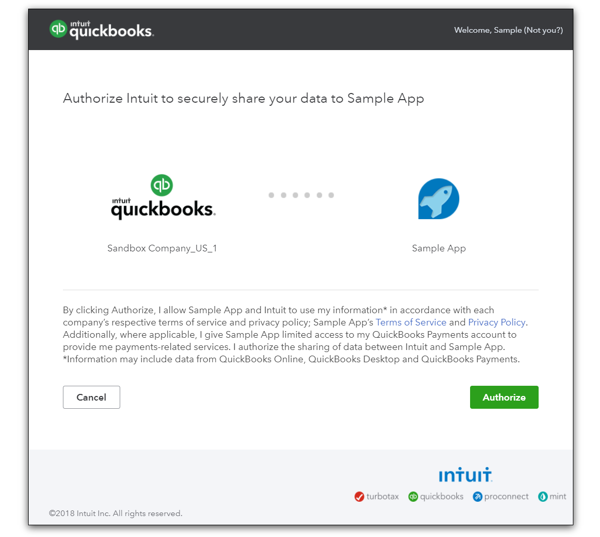
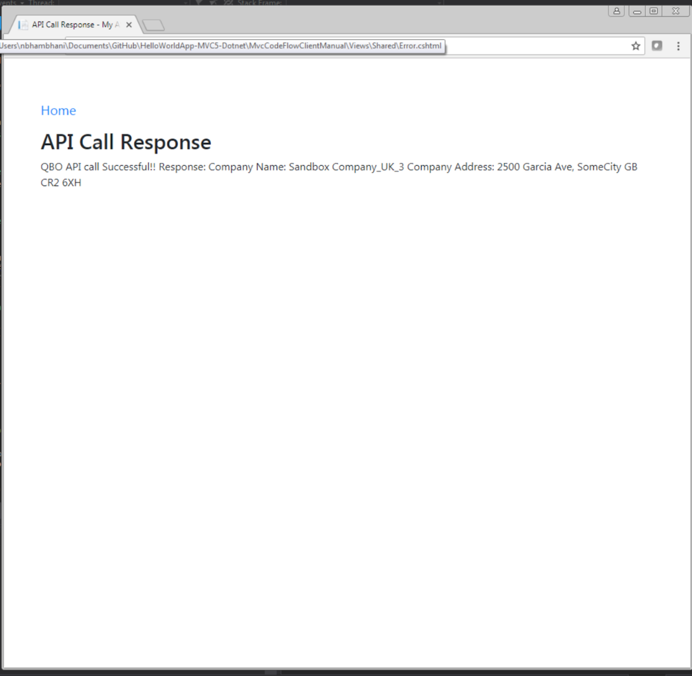

[][ss1]

# HelloWorldApp-MVC5-Dotnet
MVC5 Sample app for Dotnet

The Intuit Developer team has written this OAuth 2.0 Sample App in .Net(C#) MVC5 to provide working examples of OAuth 2.0 concepts, and how to integrate with Intuit endpoints. It uses the Owin Context to save the user cookies for the session.
More details can be read [here](https://www.asp.net/aspnet/overview/owin-and-katana) and [here](https://brockallen.com/2013/10/24/a-primer-on-owin-cookie-authentication-middleware-for-the-asp-net-developer/)

## Getting Started
Before beginning, it may be helpful to have a basic understanding of OAuth 2.0 flow. There are plenty of tutorials and guides to get started with OAuth 2.0. Check out the docs on https://developer.intuit.com/

## PreRequisites
.Net Framework 4.6.1

## Setup
Clone this repository/Download the sample app.

## Configuring your app
All configuration for this app is located in [Web.config](https://github.com/IntuitDeveloper/HelloWorldApp-MVC5-Dotnet/blob/master/MvcCodeFlowClientManual/Web.config). Locate and open this file.

We will need to update 3 items:
1. clientId
2. clientSecret
3. redirectUri

### Client Credentials
Once you have created an app on Intuit's Developer Portal, you can find your credentials (Client ID and Client Secret) under the "Keys" tab. You will also find a section to enter your Redirect URI here.

### Redirect URI
You'll have to set a Redirect URI in both 'web.config' and the Developer Portal ("Keys" section). With this app, the typical value would be http://localhost:27353/callback, unless you host this sample app in a different way (if you were testing HTTPS, for example or changing the port).

### Scopes
This sample app requires Accounting scope, please choose this if creating a new app.

## Run your app!
After setting up both Developer Portal and your [Web.config](https://github.com/IntuitDeveloper/HelloWorldApp-MVC5-Dotnet/blob/master/MvcCodeFlowClientManual/Web.config), run the sample app. 

### Connect To QuickBooks 
This flow goes through authorization flow where QBO user logs in and authorizes your app. At the end of this process, the app will end up with Access tokens.
[]

### QBO API request
Access tokens from Connect to QuickBooks flow are used to make a CompanyInfo request which gives the QBO company name, address and other data.
[]

[ss1]: https://help.developer.intuit.com/s/samplefeedback?cid=9010&repoName=HelloWorldApp-MVC5-Dotnet
